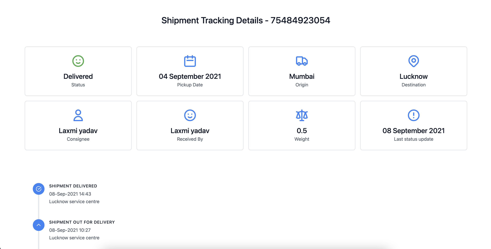
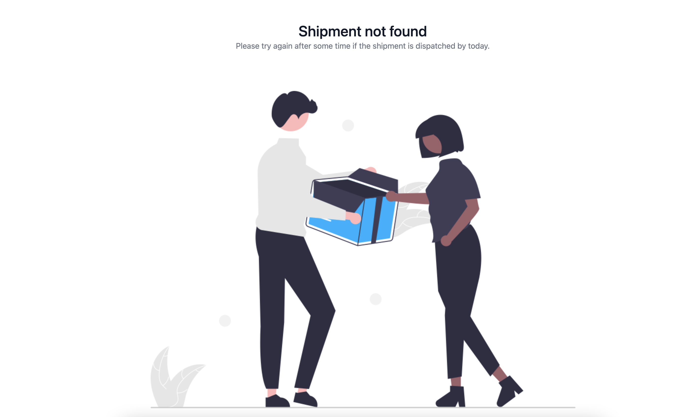

# GoApptiv Bluedart Tracking Web Component

Bluedart Tracking Component is a web component to track blue dart shipment using the cloud function API.

## Installation

Install the web component using npm

```npm
npm i @goapptiv-code/bluedart-tracking-web-component
```

Add the following keys to your environment variables. Please contact the package manager for the following key values.

```env
GOAPPTIV_BLUEDART_TRACKING_API=
```

## Usage

You can directly start using the web component. Just pass the tracking number in the properties.

This web component takes care of loading and invalid details also.

Checkpoints are optional.

```html
<bluedart-tracking-component tracking-number="75484923054" checkpoints="true" />
```

## Screenshot





## Integration with ReactJS

With an application built using the create-react-app script the easiest way to include the component library is to call defineCustomElements() from the index.js file. Note that in this scenario applyPolyfills is needed if you are targeting Edge or IE11.

```js
import React from "react";
import ReactDOM from "react-dom";
import "./index.css";

// Add the below import
import {
  applyPolyfills,
  defineCustomElements,
} from "@goapptiv-code/bluedart-tracking-web-component/loader";

...

applyPolyfills().then(() => {
  defineCustomElements();
});

```

[Stencil JS React Integration Guide](https://stenciljs.com/docs/react)
