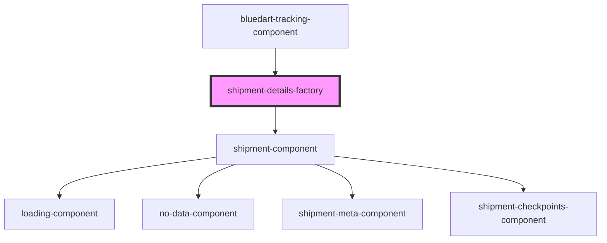

# shipment-details-factory

<!-- Auto Generated Below -->

## Properties

| Property         | Attribute         | Description | Type      | Default     |
| ---------------- | ----------------- | ----------- | --------- | ----------- |
| `checkpoints`    | `checkpoints`     |             | `boolean` | `false`     |
| `trackingNumber` | `tracking-number` |             | `string`  | `undefined` |

## Dependencies

### Used by

 - [bluedart-tracking-component](../../presentation/components/bluedart-tracking)

### Depends on

- [shipment-component](../../presentation/components/shipment)

### Graph

----------------------------------------------

*Built with [StencilJS](https://stenciljs.com/)*
