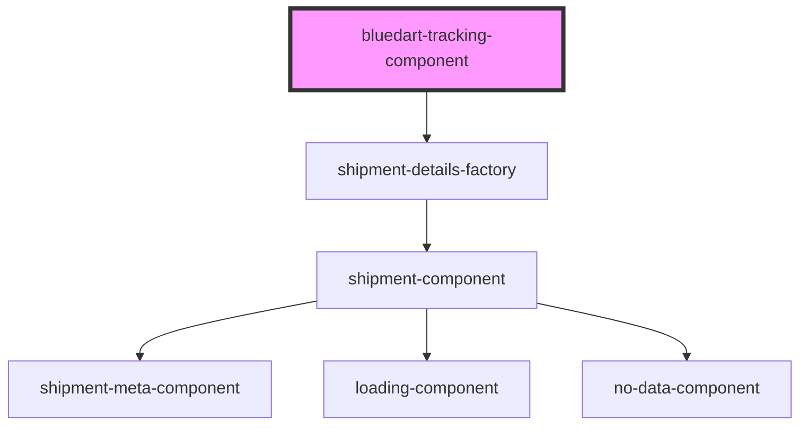

# bluedart-tracking

<!-- Auto Generated Below -->

## Properties

| Property         | Attribute         | Description         | Type      | Default     |
| ---------------- | ----------------- | ------------------- | --------- | ----------- |
| `checkpoints`    | `checkpoints`     | The checkpoints     | `boolean` | `false`     |
| `trackingNumber` | `tracking-number` | The tracking number | `string`  | `undefined` |

## Dependencies

### Depends on

- [shipment-details-factory](../../../main/factories)

### Graph

----------------------------------------------

*Built with [StencilJS](https://stenciljs.com/)*
