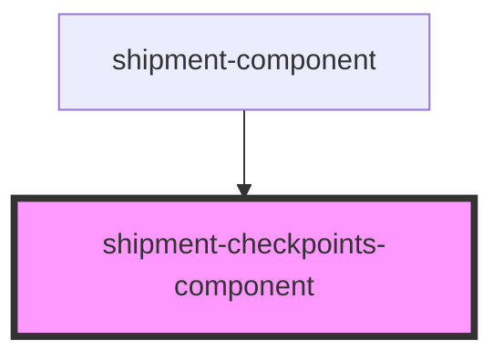

# shipment-checkpoints-component

<!-- Auto Generated Below -->

## Properties

| Property      | Attribute | Description               | Type           | Default     |
| ------------- | --------- | ------------------------- | -------------- | ----------- |
| `checkpoints` | --        | The shipment checkpoints. | `Checkpoint[]` | `undefined` |

## Dependencies

### Used by

 - [shipment-component](../shipment)

### Graph

----------------------------------------------

*Built with [StencilJS](https://stenciljs.com/)*
