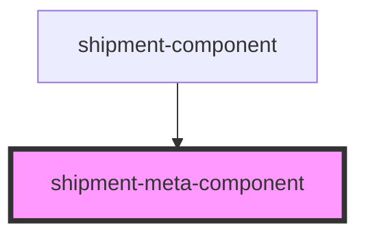

# shipment-meta-component

<!-- Auto Generated Below -->

## Properties

| Property | Attribute | Description          | Type                                                                                                                                                                                                                                                                                                                                                                                                                                                                                                                      | Default     |
| -------- | --------- | -------------------- | ------------------------------------------------------------------------------------------------------------------------------------------------------------------------------------------------------------------------------------------------------------------------------------------------------------------------------------------------------------------------------------------------------------------------------------------------------------------------------------------------------------------------- | ----------- |
| `data`   | --        | The shipment details | `{ trackingId: string; prodCode: string; service: string; pickupDate: string; pickupTime: string; origin: string; originAreaCode: string; destination: string; destinationAreaCode: string; productType: string; senderName: string; consigneeName: string; weight: string; shipmentStatus: string; shipmentStatusText: string; shipmentStatusType: string; expectedDeliveryDate: string; shipmentStatusDate: string; shipmentStatusTime: string; receivedBy: string; instructions: string; checkpoints: Checkpoint[]; }` | `undefined` |

## Dependencies

### Used by

 - [shipment-component](../shipment)

### Graph

----------------------------------------------

*Built with [StencilJS](https://stenciljs.com/)*
