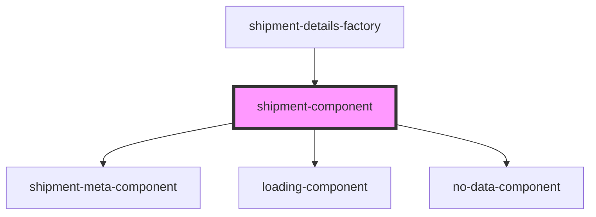

# shipment-component

<!-- Auto Generated Below -->

## Properties

| Property             | Attribute         | Description          | Type                 | Default     |
| -------------------- | ----------------- | -------------------- | -------------------- | ----------- |
| `checkpoints`        | `checkpoints`     | The checkpoints      | `boolean`            | `undefined` |
| `getShipmentDetails` | --                | Get Shipment details | `GetShipmentDetails` | `undefined` |
| `trackingNumber`     | `tracking-number` | The tracking number  | `string`             | `undefined` |

## Dependencies

### Used by

 - [shipment-details-factory](../../../main/factories)

### Depends on

- [shipment-meta-component](../shipment-meta)
- [loading-component](../loading)
- [no-data-component](../no-data)

### Graph

----------------------------------------------

*Built with [StencilJS](https://stenciljs.com/)*
